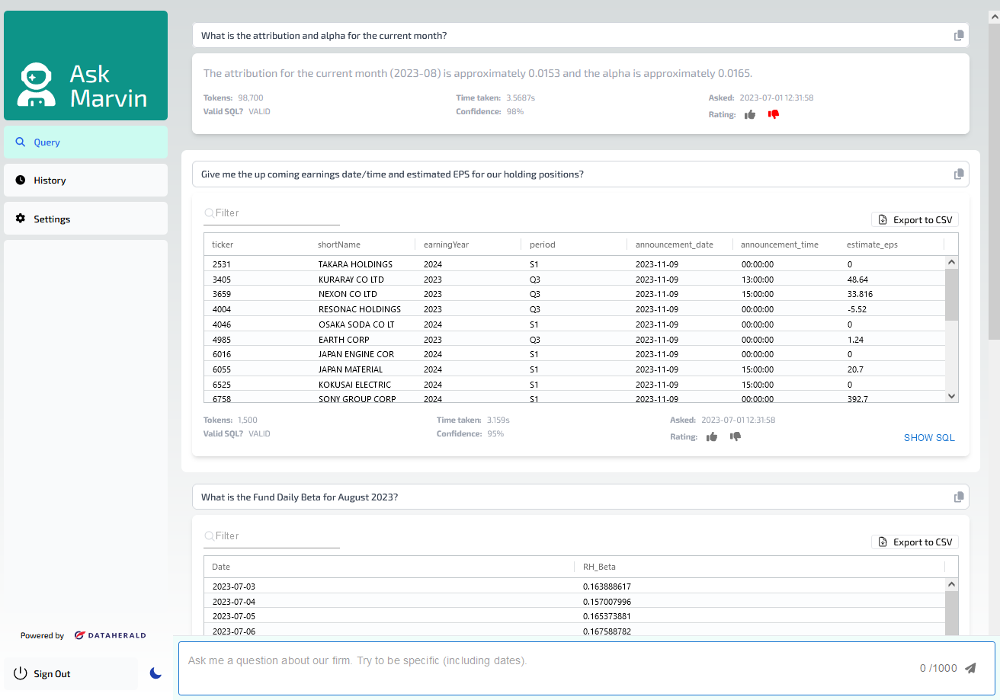

# Ask Marvin 👨‍🚀

<p align="center">
    <b>A front end for querying your company data</b>.
</p>

<div style="display:flex;">
  <div style="padding-right:10px">
    Built to interface with <a href="https://dataherald.com"> 
  </div>
  <div></a></div>
  <div style="padding-left:10px">however it should be possible to connect to other backends.</div>
</div>
<div>
  Ask Marvin will contain both the UI and settings to interface with backend APIs, starting with DataHerald.
</div>

<p align="center" style="margin-top:2em">
  <a href="./LICENSE" target="_blank">
      
  </a>
</p>


This project is in <b>active</b> development at the moment and is not yet in a state to be released.

ETA is in a few weeks.

The initial version to be released will be containerized to enable quick start up.

### Tasks outstanding to release
1. Finish server side to connect to DataHerald API
2. set up local store to save settings (MongoDB).
3. Create Docker set up.
4. Add Graphing

### Screen Shots

Light mode



Dark mode (Still adjusting)


Mobile compatible


<hr />


This is a [Next.js](https://nextjs.org/) project bootstrapped with [`create-next-app`](https://github.com/vercel/next.js/tree/canary/packages/create-next-app).


## Getting Started

First, run the development server:

```bash
npm run dev
# or
yarn dev
# or
pnpm dev
# or
bun dev
```

Open [http://localhost:3000](http://localhost:3000) with your browser to see the result.

You can start editing the page by modifying `app/page.tsx`. The page auto-updates as you edit the file.

This project uses [`next/font`](https://nextjs.org/docs/basic-features/font-optimization) to automatically optimize and load Inter, a custom Google Font.

## Learn More

To learn more about Next.js, take a look at the following resources:

- [Next.js Documentation](https://nextjs.org/docs) - learn about Next.js features and API.
- [Learn Next.js](https://nextjs.org/learn) - an interactive Next.js tutorial.

You can check out [the Next.js GitHub repository](https://github.com/vercel/next.js/) - your feedback and contributions are welcome!

## Deploy on Vercel

The easiest way to deploy your Next.js app is to use the [Vercel Platform](https://vercel.com/new?utm_medium=default-template&filter=next.js&utm_source=create-next-app&utm_campaign=create-next-app-readme) from the creators of Next.js.

Check out our [Next.js deployment documentation](https://nextjs.org/docs/deployment) for more details.


